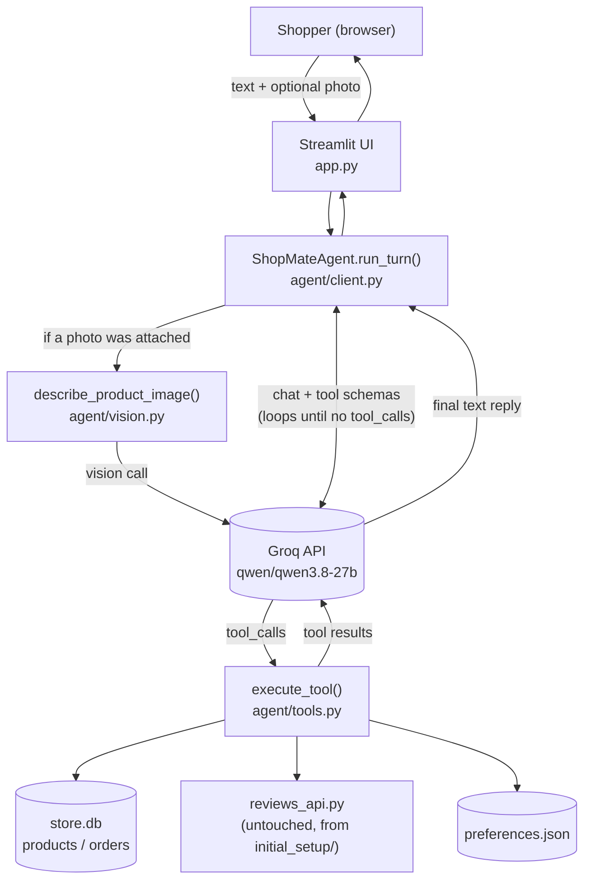
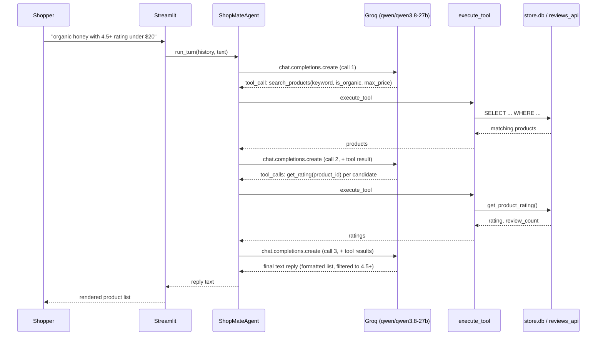

# ShopMate

ShopMate is a conversational shopping assistant for a small online pantry store (honey, oils, nuts and seeds, grains, tea and coffee, snacks, dairy alternatives). Instead of clicking through category pages and filters, a shopper describes what they want in plain language, or uploads a photo, and ShopMate searches the store, shows ratings, and places the order once the shopper confirms. Full requirements are in [PRD.md](PRD.md); this doc covers how it's built, how to run it, and how we'd judge whether it's working.

## Product summary

| | |
|---|---|
| **Who it's for** | A shopper who already knows roughly what they want and doesn't want to browse (PRD §5) |
| **Core flows** | Browsing, photo search, ordering (PRD §6) |
| **Out of scope** | Multi-item cart, payments/returns/tracking, login/multi-user, RAG (PRD §4) |
| **LLM** | Groq, `qwen/qwen3.8-27b` — one model for both chat/tool-use and vision |
| **UI** | Streamlit, single chat page with image upload |
| **State that survives a restart** | Orders (`store.db`) and preferences (`preferences.json`) — the conversation itself does not |

## Architecture

Every shopper turn flows through one `ShopMateAgent` instance, which runs a tool-use loop against Groq until the model has enough information to answer without calling another tool.



A concrete example — "organic honey with 4.5+ rating under $20" — takes 3 round trips to Groq (measured, see [Cost & performance](#cost--performance-measured) below):



### Folder structure

```
project_shopping_agent/
├── PRD.md                     # the spec — built from PRODUCT_BRIEF.md
├── README.md                  # this file
├── assignment.md              # the course assignment brief
├── eval_set.csv               # starter eval cases (Step 5)
├── requirements.txt
├── app.py                     # Streamlit chat UI + image upload
├── agent/
│   ├── client.py              # ShopMateAgent — the Groq tool-use loop
│   ├── system_prompt.py       # the three flows, output format, guardrails
│   ├── tools.py                # the 5 tool schemas + execute_tool dispatcher
│   ├── db.py                   # SQLite access — products, orders
│   ├── preferences.py         # durable shopper preferences (JSON on disk)
│   └── vision.py               # photo → item/keyword/organic via Groq vision
├── initial_setup/             # given, untouched
│   ├── setup_db.py            # creates store.db (products, reviews, orders)
│   └── reviews_api.py         # the only path to ratings (PRD §11 rule 2)
├── resources/                  # given test images (honey, oats, elephant)
├── tests/                      # pytest — db, preferences, tool dispatcher
│   ├── test_db.py
│   ├── test_preferences.py
│   └── test_tools.py
├── docs/superpowers/plans/     # the implementation plan this was built from
├── .env                        # GROQ_API_KEY — gitignored, created locally
├── store.db                    # created by setup_db.py — gitignored
└── preferences.json            # created at runtime — gitignored
```

### Key design decisions

| Decision | Choice | Why |
|---|---|---|
| LLM provider | Groq, `qwen/qwen3.8-27b` | PRD left this "to be decided." Landed here after two false starts — an Anthropic key with no credit balance, then a mix-up between "Grok" (xAI) and "Groq" — because it's one OpenAI-compatible model with both tool-calling and vision. |
| Preferences storage | Flat file, `preferences.json` | PRD §6.6 explicitly allows "a small table, a JSON file, anything durable" for a single-shopper scope — a JSON file is the simplest thing that's actually durable. |
| Output list format | Enforced via the system prompt, not string-templated in code | The course evals (Step 5) are meant to test whether the *model* reliably follows the format — templating it in code would test the code instead. |
| Guardrails (off-topic, no order without "yes") | Prompt-level only, for now | Matches PRD §8 ("Enforced by: Prompt"). Step 4 of the assignment revisits whether code-level enforcement is also needed. |
| Conversation history | `st.session_state` only, not persisted | PRD §4 rules out login/multi-user; only orders and preferences need to outlive a restart. |

## Setup

**Prerequisites:** Python 3.10+, a [Groq](https://console.groq.com) API key.

1. Create and activate a virtual environment, then install dependencies:

   ```bash
   python -m venv .venv
   .venv\Scripts\activate
   pip install -r requirements.txt
   ```

2. Add your Groq API key to `.env`:

   ```
   GROQ_API_KEY=your-key-here
   ```

3. Create the store database (safe to re-run; it resets products/reviews and leaves orders alone):

   ```bash
   python initial_setup/setup_db.py
   ```

## Run

```bash
streamlit run app.py
```

Opens a chat UI (default `http://localhost:8501`). Type what you're looking for, or upload a product photo (PNG/JPG) alongside your message.

## Test

```bash
pytest
```

Runs the automated tests for the database, preferences, and tool-dispatcher layers (16 tests, `tests/`). The LLM agent loop, vision tool, and UI are verified manually against the checklist in `assignment.md`.

## Metrics

Two different questions, both worth tracking: *is the agent behaving correctly* (AI quality), and *is it doing its job for the shopper* (product). A third — *what does it cost* — is measured below with real numbers, not estimates.

### AI / agent quality metrics

| Metric | Definition | How to measure | Status |
|---|---|---|---|
| Tool-call accuracy | Right tool, called with the right filters, for a given request | `eval_set.csv` runner comparing expected vs. actual tool + args (Step 5) | Not yet built |
| Format compliance rate | % of product lists matching `#N. <Name> \(ID:\d+\) — \$[\d.]+ ★[\d.]+( — organic)?` | Regex against every list reply in an eval run | Not yet measured at scale; 100% in manual spot checks so far |
| Hallucination rate | Any product/price/rating stated that didn't come from a tool result | Cross-check reply text against `store.db` | 0 observed across manual testing; no automated check yet |
| Guardrail trip rate | % of off-topic / photo-of-non-product inputs correctly redirected without a tool call | `eval_set.csv` rows tagged off-topic | 2/2 in manual testing (text poem request, elephant photo) |
| Confirmation compliance | % of orders preceded by an explicit shopper "yes"/number, 0% of orders placed without one | Audit `orders` table against conversation transcripts | No violations observed; not yet automated |
| Round trips per turn | Number of Groq API calls needed to answer one shopper message | Instrumented count in `agent/client.py`'s loop | Measured: 3 calls for a filtered browse-and-rate query (see below) |

### Product metrics (what we'd track with real shoppers)

| Metric | Why it matters |
|---|---|
| Search-to-order conversion rate | Do shown products actually lead to a purchase, or does the shopper give up? |
| Messages per completed order | PRD's job-to-be-done is "two messages" — this is the number that proves or disproves it |
| Preference adoption rate | % of shoppers who ever set a standing preference — signals whether the feature is discoverable/valuable |
| Photo-search share of searches | Is image upload a real usage path or a novelty? |
| Repeat "what have I ordered before" usage | Signals whether shoppers trust/use order history as a feature, not just a demo checkbox |

These aren't instrumented yet — there's no traffic. They're here so the eval/analytics work in later steps has a target, per `assignment.md`'s "Next week: Metrics" prompt.

### Cost & performance (measured)

Groq's `qwen/qwen3.8-27b` is a **Preview model**: $0.80 / 1M input tokens, $4.00 / 1M output tokens ([console.groq.com/docs/models](https://console.groq.com/docs/models)). Preview models "should not be used in production... may be discontinued at short notice" — worth flagging as a real operational risk before this goes anywhere beyond the assignment.

Measured directly (not estimated) by instrumenting one real turn — "organic honey with 4.5+ rating under $20" — end to end:

| | |
|---|---|
| API calls (tool round trips) | 3 |
| Prompt tokens | 4,404 |
| Completion tokens | 369 |
| Total tokens | 4,773 |
| Wall-clock time | 3.35s |
| **Cost, this turn** | **≈ $0.0050** (4,404 × $0.80/1M + 369 × $4.00/1M) |

A full conversation (browse → confirm → order, ~3 shopper messages) lands around **$0.01–0.02**. At that price, cost is not the constraint on this design — the Preview-tier stability risk above is the bigger one to watch.

## Demo

<Loom link>

## Next steps

- **Guardrails** (`GUARDRAILS.md`) — Step 4: decide and document whether "no order without confirmation" needs code-level enforcement in addition to the prompt.
- **Evals** (`EVALS.md`) — Step 5: extend `eval_set.csv`, build the runner referenced in the AI-quality metrics table above, and turn "Not yet measured" into real numbers.
- Implementation plan this was built from: [docs/superpowers/plans/2026-09-16-shopping-agent.md](docs/superpowers/plans/2026-09-16-shopping-agent.md)
